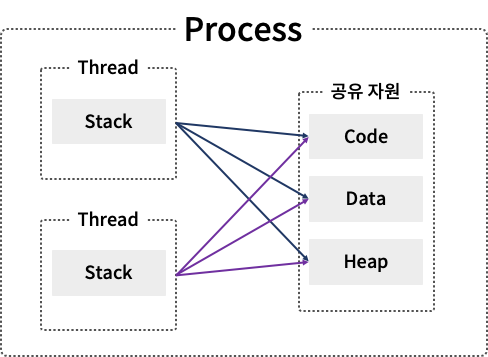

# 운영체제 내에서의 프로세스와 스레드

## 프로세스(Process)

컴퓨터에서 연속적으로 실행되고 있는 컴퓨터 프로그램을 뜻한다.

프로세스는 네 가지의 구조로 되어있다.

- Code area : 프로그래머가 작성한 프로그램이 코드 영역에 작성됨.

- Data area : 코드가 실행되면서 사용한 변수나 파일들의 각종 데이터들이 모여있다.

- Stack area : 호출한 함수가 종료되면 되돌아올 메모리의 주소를 스택에 저장하거나 변수 사용 범위에 영향을 미치는 영역을 구현할 때 사용된다.

- Heap area : 동적으로 할당되는 데이터들을 위해 존재하는 공간

서로 다른 프로세스 간 메모리 공간 접근은 허용되지 않는다.

### 프로그램

프로그램은 하드디스크 등 저장장치에 저장되어 있는 실행 코드를 뜻함.

---

## 스레드(Thread)

프로세스 내에서 실행되는 흐름의 단위를 뜻한다.

---

## 멀티 태스킹

OS를 통해 CPU가 작업하는데 필요한 자원(시간)을 프로세스 또는 스레드 간 나누는 행위

## 멀티 프로세스 vs 멀티 스레드

멀티 프로세스는 각 프로세스 간 메모리 공간에 접근할 수 없지만, 스레드는 stack만 따로 할당받고 Code, Data, Heap area를 공유한다.
한 스레드가 프로세스 자원을 변경하면, 다른 이웃 스레드도 그 변경 결과를 즉시 볼 수 있다.

### 멀티 프로세스

하나의 애플리케이션을 여러개의 프로세스로 구성하여 각 프로세스가 하나의 작업을 처리하도록 하는 것.

- 프로세스 중 하나에 문제가 발생해도 다른 프로세스에 영향을 미치지 않는다.
- 각 프로세스가 독립적으로 동작하며 비교적 구현이 간단하다.
- 메모리 사용량이 많고, 성능 저하의 우려가 있다.

### 멀티 스레드

하나의 애플리케이션을 여러 개의 스레드로 구성하여 하나의 스레드가 하나의 작업을 처리하도록 하는 것.

- 프로그램의 일부분이 오류 또는 긴 작업으로 중단되어도 프로그램이 계속적으로 수행될 수 있다.
- 부모 프로세스와 자원과 메모리를 공유한다.
- 각각 스레드가 다른 프로세서에서 병렬로 수행될 수 있다.
- 구현 및 테스트, 디버깅이 비교적 어렵다.
- 자식 스레드 중 하나에 생긴 문제가 전체 프로세스에 영향을 줄 수 있다.

---

출처
- https://ko.wikipedia.org/wiki/프로세스
- https://ko.wikipedia.org/wiki/스레드_(컴퓨팅)
- https://inpa.tistory.com/entry/👩%E2%80%8D💻-프로세스-⚔%EF%B8%8F-쓰레드-차이