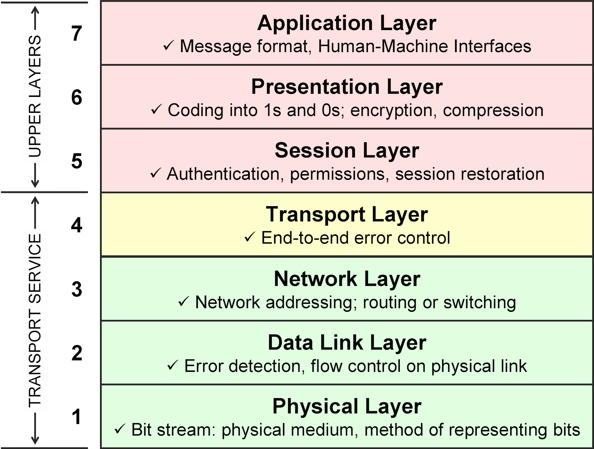
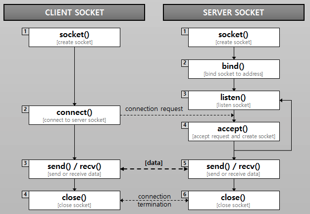

# 네트워크(Network)

둘 이상의 컴퓨터와 이들을 연결하는 링크의 조합이다.

- 몰리적 네트워크 : 네트워크를 구성하는 HW(어댑터, 케이블 등)
- 논리적 네트워크 : SW 및 개념적 모델로 형성

## OSI7계층



### 1. 물리 계층(Physical layaer)

```
- 전송 단위 : 비트
- 장비 : 케이블, 허브 등
```

전기적 신호가 나가는 물리적인 장비, 단지 데이터를 전달할 뿐 전송하는 데이터의 내용은 신경쓰지 않고 단지 데이터를 전기적 신호로 변환하여 주고 받는 기능만 있음.


### 2. 데이터 링크 계층(Data link layaer)

```
- 전송 단위 : 프레임
- 장비 : 브릿지, 스위치, 이더넷 등
```

물리계층을 통해 송수신되는 정보의 흐름을 관리하여 안전한 정보 전달을 수행할 수 있도록 도와줌.

### 3. 네트워크 계층(Network layaer)

```
- 전송 단위 : 패킷
```

Route와 IP를 정하고 패킷을 전달함. 목적지까지 안전하고 빠르게 데이터를 보내기 위한 최적의 경로 설정

### 4. 전송 계층(Transport layaer)

```
- 전송 단위 : 세그먼트
```

사용자들 간 신뢰성 있는 데이터를 교환할 수 있게 함.
오류검출 및 복구, 흐름제어, 중복 검사 등을 수행함.

데이터 전송을 위해 Port 번호를 사용하며, 대표적인 프로토콜로 TCP와 UDP가 있음.

### 5. 세션 계층(Session layaer)

응용프로세스가 통신을 관리하기 위한 방법을 정의.

TCP/IP 세선을 만들고 없애는 역할을 수행

### 6. 표현 계층(Presentation layaer)

전송하는 데이터의 표현 방식을 결정(데이터 변환, 압축, 암호화)

- 송신자에게서 온 데이터를 해석하기 위한 응용계층 데이터 부호화, 변화)
- 수신자에게서 데이터 압축을 풀 수 있는 방식으로 된 데이터 압축
- 데이터 암호화와 복호화

### 7. 응용 계층(Application layaer)

응용서비스, 프로세스가 응용계층에서 동작.

---

## Socket통신

소켓은 프로세스가 네트워크로 데이터를 내보내거나, 받기 위한 창구 역할을 한다. 프로세스가 데이터를 보내거나 받기 위해서는 반드시 소켓을 열어서 소켓에 데이터를 써보내거나, 소켓으로부터 데이터를 읽어들여야 한다.

- `프로토콜` : 한 시스템이 다른 시스템과 통신을 원활하게 해주는 통신 규약
- `IP`: 고유 식별 주소
- `포트` : 네트워크에서 통신하기 위해 호스트 내부적으로 프로세스가 할당받아야 하는 고유한 숫자.
한 호스트 내에서 네트워크 통신을 하고있는 프로세스를 식별하기 위해 사용되는 값이므로 같은 호스트 내에서 서로 다른 프로세스가 같은 포트 넘버를 가질 수 없음.

### 서버와 클라이언트



`서버` : 클라이언트 소켓의 연결 요청을 대기하고, 연결 요청이 오면 클라이언트 소켓을 생성하여 통신이 가능하게 함.

`클라이언트` : 실제로 데이터 송수신이 일어나는 소켓

### 소켓의 종류

- `TCP(스트림)`
  - 양방향으로 바이트 스트림을 전송, 연결 지향성
  - 오류 수정, 정송처리, 흐름제어 보장
  - 송신된 순서에 따라 중복되지 않게 데이터를 수신
  - 소량의 데이터보다 대량의 데이터 전송에 적합함.

- `UDP(데이터그램)`
  - 비연결형 소켓
  - 데이터 크기에 제한이 있음.
  - 확실한 전달이 보장되지 않음(데이터가 손실되어도 오류가 발생하지 않음)
  - 실시간 멀티미디어 정보를 처리하기 위해 주로 사용함.

### HTTP vs Socket

- `HTTP` : 클라이언트의 요청이 있을 때만 서버가 응답하여 정보를 전송하고 곧바로 연결을 종료.
  - 클라이언트가 요청을 보내는 경우에만 서버가 응답
  - 실시간 연결이 아님

- `Socket` : 클라이언트와 서버가 특정 Port를 통해 실시간으로 양방향 소통
  - 서버와 클라이언트가 계속 연결을 유지함.
  - 서버와 클라이언트가 실시간으로 데이터를 주고받는 상황이 필요한 경우 사용

---

출처
- https://www.ibm.com/docs/ko/aix/7.2?topic=management-network-communication-concepts
- https://inpa.tistory.com/entry/WEB-🌐-OSI-7계층-정리
- https://helloworld-88.tistory.com/215